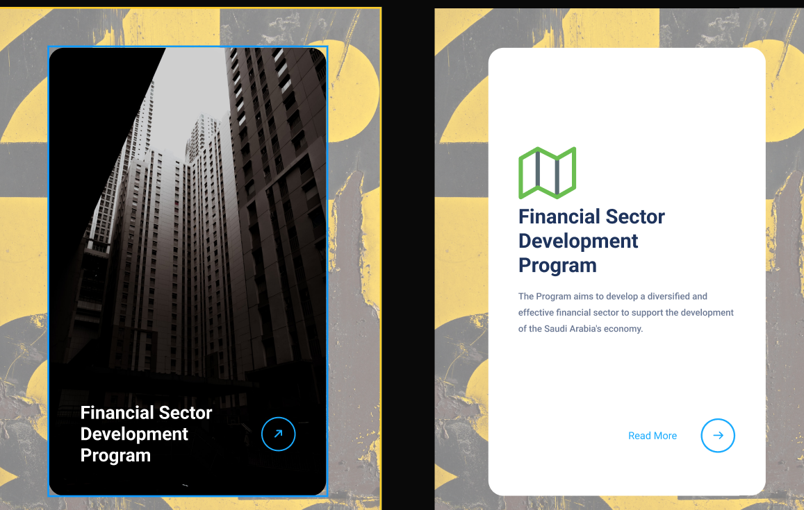

#3D CSS Flip Card Component

3D CSS Flip Card Component
This project is a front-end challenge to build a responsive and interactive 3D flip card from scratch using only HTML5 and CSS3. The goal was to take a professional design mockup and translate it into a functional component, focusing on the CSS 3D transform model without relying on any frameworks or JavaScript.
The result is a clean, reusable component that demonstrates a deep understanding of CSS animations, transitions, and layout properties.
✨ Key Features & Concepts
Interactive 3D Flip Effect: The card flips on hover to reveal back-side content, creating a dynamic user experience.
Pure CSS Solution: The entire animation and interaction is handled by CSS, with no JavaScript required.
Responsive Design: The component is built with flexible properties to fit within various layouts.
Semantic HTML: The structure is written with clean, semantic HTML5 for clarity and accessibility.
Design Recreation: The project successfully translates a UI design into functional code.
🛠️ Technologies & Techniques Used
This project showcases a range of modern CSS techniques:
HTML5: For the semantic structure of the card.
CSS3:
3D Transforms: perspective, transform-style: preserve-3d, and rotateY() are used to create the core 3D effect.
Transitions: transition provides the smooth animation between the front and back states.
Advanced Positioning: position: absolute is used to stack the front and back faces in the same space.
Pseudo-classes: The :hover pseudo-class triggers the animation.
backface-visibility: A key property used to hide the back of the elements as they rotate.
🚀 Project Goals & Learning
The main objective was to move beyond basic CSS and master the intricacies of the 3D transform model. Key learning points included:
The Parent-Child Relationship: Understanding that perspective must be on the parent container to create the 3D "stage."
The Initial State: Realizing the back face of the card must start pre-rotated for the flip animation to work correctly.
Stacking Context: Gaining a deeper understanding of how position: absolute works within a transformed parent.
